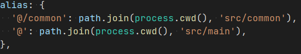
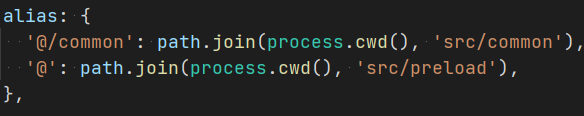
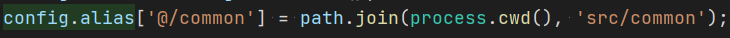

## <small>2.0.6(2021-05-18)</small>

1、routeMode支持browser

## <small>2.0.5(2021-05-08)</small>

1、将主进程调试默认打开

## <small>2.0.4(2021-04-16)</small>

1、自动处理一些容易出错的配置，默认将electron-updater包含在打包的package.json中

## <small>2.0.2(2021-03-27)</small>

1、兼容 Webpack5

2、优化 webpack 下的构建速度

## <small>2.0.0(2021-03-27)</small>

1、默认不在自动复制模板，需要执行 umi electron init 或 yarn electron:init 复制模板

2、重构，现在支持 Vite 构建，需要配置开启，默认为 Webpack 构建

3、去掉 electron-webpack，electron-webpack-ts 依赖

4、主进程文件 src/main/main.ts 变更为 src/main/index.ts

5、删除 mainWebpackConfig

6、增加 viteConfig，在buildType为vite时有效，配置参考 https://vitejs.dev/config/

7、增加 mainWebpackChain，在 buildType 为 webpack 时有效

8、src/main/tsconfig.json 变为可选

9、增加 src/preload/index.ts（可选），src/preload/tsconfig.json（可选）

10、修复与 fastRefresh 冲突

11、默认配置 alias

- main 下

- preload 下

- renderer 下

## <small>1.x 更新日志</small>

- [更新日志](https://github.com/BySlin/umi-plugin-electron-builder/blob/1.x/CHANGELOG.md)
